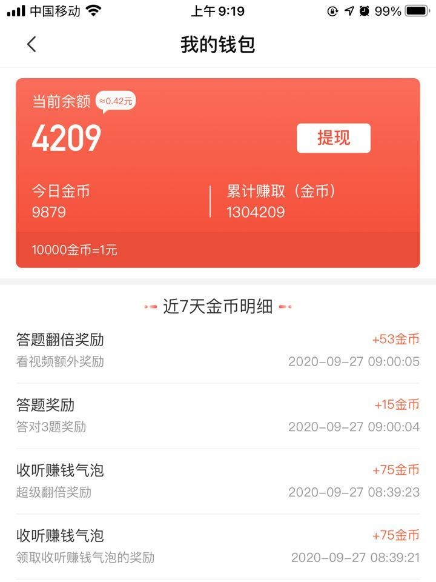
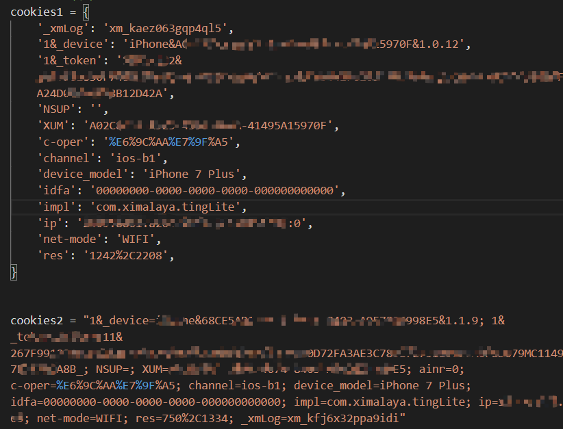

# 喜马拉雅极速版

开个新坑

喜马拉雅**极速版**自动化脚本

暂时无法每天签到

 [xmly_speed](xmly_speed.py) 

### 邀请任务

[邀请链接](https://1577553307077650.cn-beijing.fc.aliyuncs.com/2016-08-15/proxy/xmly-GreetingService-812BA409BF91/GreetingFunction/)  （点击之后会自动下载一个txt文件，里面包含了邀请链接，介意勿点）

如果你不介意，并且之前没有注册过喜马拉雅的话，可以帮我完成一个邀请任务，感谢。

### 运行方案

1、GitHub action自动运行，账号信息读取自`Repo-Setting-Secrets`  

- cookie 信息抓包自手机app，域名为 `m.ximalaya.com`的可以
- fork 本项目
- Secrets 新增 `XMLY_SPEED_COOKIE`，填入cookie信息 ，多账号换行
- star一下，立即执行，观察运行情况
-  **必须**修改一下文件才能定时运行

2、下载到本地运行   
   需要两个第三方库 `rsa`和 `requests`  
   
### Cookie填写
形如:  
  
两种填写方式都支持

### 查看

点击 Actions -Workflows

### Note
部分新手任务接口没有抓到，需要手动完成  
有些游戏 (比如猜拳) 第一次需要手动运行
